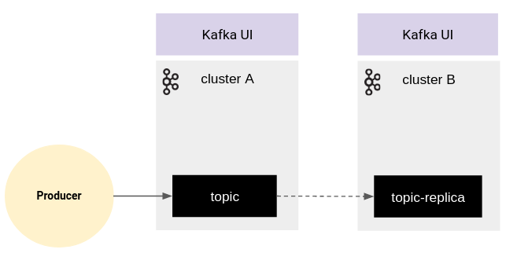
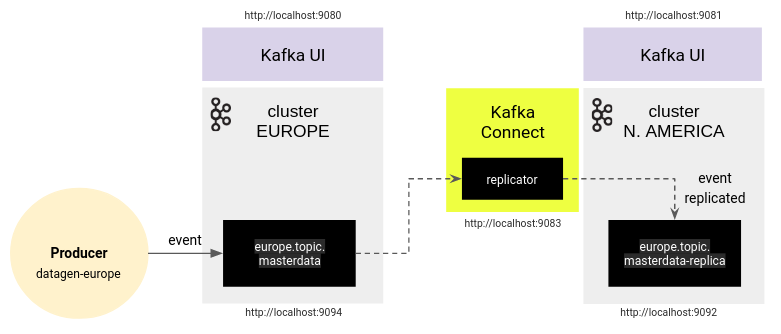
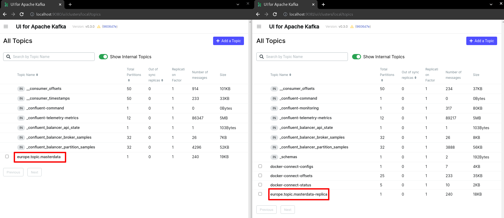

# Confluent Replicator Starter Kit
En este repositorio se puede encontrar una PoC lista para poder empezar a trabajar con Confluent Replicator.

## Requerimientos
Para poder ejecutar la PoC, es necesario tener intalado Docker y Docker Compose.

## Entorno
La idea detrás de esta PoC es la de mostrar cómo configurar e implementar una solución que permita **replicar** *topics* y *mensajes* de un *cluster* de *Apache Kafka* a otro con la herramienta **Confluent Replicator**.

Para ello, se diseña un entorno que consta de lo siguiente:

- Dos ***clusters*** de *Apache Kafka* (plataforma *Confluent*) para replicar un *topic* de un *cluster* a otro.
- Un ***visualizador*** por *cluster* para verificar el funcionamiento de la  replicación y visualizar el *topic* y los *mensajes* asociados (origen y réplica) 
- Un ***productor*** de eventos que genera *mensajes* en un *topic* del *cluster* origen.


<br/>

## Puesta en marcha

La puesta en marcha es muy sencilla. 

Desde la raíz del proyecto, se tiene que ejecutar el siguiente [script](init.sh), que genera todo el entorno necesario para mostrar un caso de uso de la herramienta *Confluent Replicator*.

````shell
sh init.sh
````

> **NOTA** - Es posible que dependiendo del S.O. el script necesite de alguna pequeña modificación. 

Al finalizar la ejecución del script (tarda unos minutos), en el entorno local se tiene disponible lo siguiente:

- ***Cluster origen*** de *Apache Kafka* (*Confluent*). Broker Europa:  http://localhost:9094
- ***Cluster destino*** de *Apache Kafka* (*Confluent*). Broker América del Norte: http://localhost:9092
- ***Productor*** que escribe cada 20sg un evento en el *topic* ***europe.topic.masterdata*** del *cluster* origen.
- ***Kafka UI*** para visualizar el *cluster* origen: http://localhost:9080
- ***Kafka UI*** para visualizar el *cluster* destino: http://localhost:9081
- El servicio ***Kafka Connect***, http://localhost:8083, preparado con *Confluent Replicator* para replicar el *topic* ***europe.topic.masterdata*** al *cluster* destino como ***europe.topic.masterdata-replica***.



Una vez hecho esto, ya se tiene la PoC implementada en la que se replica en tiempo real la información del *topic* ***europe.topic.masterdata*** del cluster ***EUROPE*** (origen) al cluster ***N.AMERICA*** (destino).


<br/>

## Destruyendo el entorno

Para destruir el entorno, simplemente tenemos que lanzar el siguiente [script](stop.sh)

````shell
sh stop.sh
````
